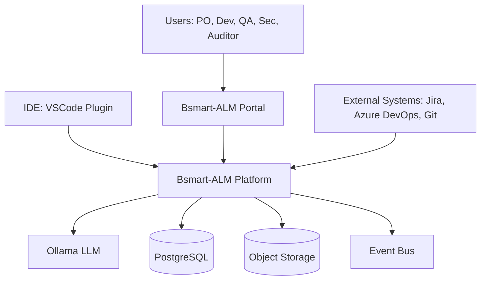
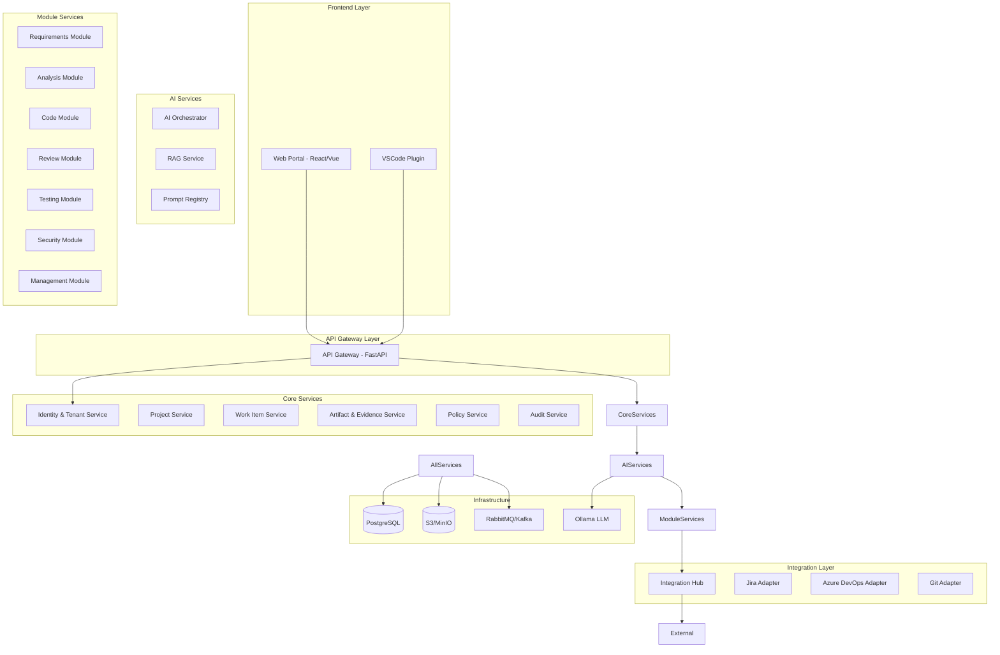
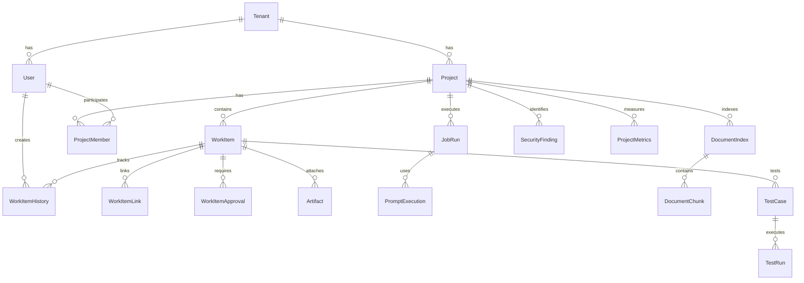

# Design Document - Bsmart-ALM Platform

## Overview

O Bsmart-ALM é uma plataforma de Application Lifecycle Management AI-first construída com arquitetura de microserviços. A plataforma utiliza FastAPI para APIs REST, SQLModel para ORM, PostgreSQL como banco de dados relacional, e Ollama (llama-3.2) como motor de IA. Todo o sistema é containerizado com Docker e preparado para orquestração Kubernetes.

A arquitetura segue princípios de Domain-Driven Design (DDD), separação de responsabilidades, e event-driven architecture para comunicação assíncrona entre módulos. O sistema é multi-tenant por design, com isolamento completo de dados e configurações por organização.

### Key Design Principles

1. Multi-tenancy First: tenant_id obrigatório em todas as entidades
2. Event-Driven: comunicação assíncrona via event bus para desacoplamento
3. API-First: todos os serviços expõem APIs REST documentadas (OpenAPI)
4. Audit by Design: trilhas automáticas de auditoria em todas as operações relevantes
5. Idempotency: operações de IA e integrações são idempotentes
6. Fail-Safe: falhas em módulos não afetam outros módulos
7. Observability: logs estruturados, métricas e traces em todos os serviços

## Architecture

### High-Level Architecture (C4 - Context)



### Container Architecture (C4 - Container)



## Components and Interfaces

### 1. API Gateway

Ponto de entrada único para todas as requisições externas.

**Responsibilities:**
- Autenticação e validação de tokens
- Rate limiting por tenant
- Request routing para serviços internos
- Response aggregation quando necessário
- CORS e security headers

**Technology Stack:**
- FastAPI com middleware customizado
- JWT para autenticação
- Redis para rate limiting

**Key Endpoints:**
```
POST   /api/v1/auth/login
POST   /api/v1/auth/token/refresh
GET    /api/v1/projects
POST   /api/v1/projects
GET    /api/v1/work-items
POST   /api/v1/work-items
...
```

### 2. Identity & Tenant Service

Gerencia autenticação, autorização e multi-tenancy.

**Data Models:**
```python
class Tenant(SQLModel, table=True):
    id: UUID
    name: str
    slug: str  # unique
    settings: dict  # JSON
    created_at: datetime
    is_active: bool

class User(SQLModel, table=True):
    id: UUID
    tenant_id: UUID  # FK to Tenant
    email: str
    hashed_password: str
    full_name: str
    is_active: bool
    created_at: datetime

class Role(SQLModel, table=True):
    id: UUID
    tenant_id: UUID
    name: str  # admin, po, dev, qa, sec, auditor
    permissions: list[str]  # JSON array

class UserRole(SQLModel, table=True):
    user_id: UUID
    role_id: UUID
    project_id: UUID | None  # role can be project-specific
```

**Key Operations:**
- authenticate_user(email, password) → JWT token
- validate_token(token) → User + Tenant + Roles
- check_permission(user, resource, action) → bool
- create_api_token(user, scope) → API token

### 3. Project Service

Gerencia projetos e suas configurações.

**Data Models:**
```python
class Project(SQLModel, table=True):
    id: UUID
    tenant_id: UUID
    name: str
    description: str
    status: ProjectStatus  # ACTIVE, ARCHIVED
    settings: ProjectSettings  # JSON
    created_at: datetime
    created_by: UUID

class ProjectSettings(BaseModel):
    target_cloud: str  # AWS, Azure, GCP, OCI
    mps_br_level: str  # G, F, E, D, C, B, A
    code_standards: dict
    allowed_sources: list[str]  # whitelist URLs
    default_policies: dict

class ProjectMember(SQLModel, table=True):
    project_id: UUID
    user_id: UUID
    role_id: UUID
    joined_at: datetime
```

**Key Operations:**
- create_project(tenant_id, data) → Project
- update_project_settings(project_id, settings)
- add_member(project_id, user_id, role_id)
- get_project_whitelist(project_id) → list[str]

### 4. Work Item Service

Gerencia todos os tipos de work items com state machine.

**Data Models:**
```python
class WorkItemType(str, Enum):
    REQUIREMENT = "requirement"
    USER_STORY = "user_story"
    ACCEPTANCE_CRITERIA = "acceptance_criteria"
    TASK = "task"
    DEFECT = "defect"
    NFR = "nfr"

class WorkItemStatus(str, Enum):
    DRAFT = "draft"
    IN_REVIEW = "in_review"
    APPROVED = "approved"
    REJECTED = "rejected"
    IN_PROGRESS = "in_progress"
    DONE = "done"

class WorkItem(SQLModel, table=True):
    id: UUID
    tenant_id: UUID
    project_id: UUID
    type: WorkItemType
    title: str
    description: str
    status: WorkItemStatus
    version: int
    created_by: UUID
    created_at: datetime
    updated_at: datetime

class WorkItemLink(SQLModel, table=True):
    id: UUID
    tenant_id: UUID
    source_id: UUID  # FK to WorkItem
    target_id: UUID  # FK to WorkItem
    link_type: str  # "implements", "tests", "blocks", "relates"

class WorkItemHistory(SQLModel, table=True):
    id: UUID
    work_item_id: UUID
    version: int
    changed_by: UUID
    changed_at: datetime
    changes: dict  # JSON with field changes
    snapshot: dict  # full snapshot of work item

class WorkItemApproval(SQLModel, table=True):
    id: UUID
    work_item_id: UUID
    version: int
    approved_by: UUID
    approved_at: datetime
    decision: str  # APPROVED, REJECTED
    comments: str
```

**State Machine:**
```
DRAFT → IN_REVIEW → APPROVED → IN_PROGRESS → DONE
              ↓
           REJECTED → DRAFT (after fixes)
```

**Key Operations:**
- create_work_item(tenant_id, project_id, data) → WorkItem
- transition_status(work_item_id, new_status, user_id) → WorkItem
- approve_work_item(work_item_id, user_id, comments) → Approval
- link_work_items(source_id, target_id, link_type)
- get_traceability(work_item_id) → TraceabilityGraph

### 5. AI Orchestrator Service

Orquestra jobs de IA com retry, timeout e idempotência.

**Data Models:**
```python
class JobType(str, Enum):
    EXTRACT_REQUIREMENTS = "extract_requirements"
    GENERATE_SPEC = "generate_spec"
    REVIEW_CODE = "review_code"
    GENERATE_TESTS = "generate_tests"
    SECURITY_SCAN = "security_scan"

class JobStatus(str, Enum):
    PENDING = "pending"
    RUNNING = "running"
    COMPLETED = "completed"
    FAILED = "failed"
    CANCELLED = "cancelled"

class JobRun(SQLModel, table=True):
    id: UUID
    tenant_id: UUID
    project_id: UUID
    job_type: JobType
    status: JobStatus
    input_data: dict  # JSON
    output_data: dict | None  # JSON
    model_metadata: dict  # model, version, params
    idempotency_key: str  # unique per input
    retry_count: int
    max_retries: int
    timeout_seconds: int
    started_at: datetime | None
    completed_at: datetime | None
    error_message: str | None
    created_by: UUID
```

**Key Operations:**
- create_job(tenant_id, project_id, job_type, input_data, idempotency_key) → JobRun
- execute_job(job_id) → result
- retry_job(job_id)
- cancel_job(job_id)
- get_job_status(job_id) → JobStatus

**Worker Architecture:**
- Workers consomem jobs da fila (RabbitMQ/Kafka)
- Cada worker processa um tipo de job
- Timeout implementado com asyncio.wait_for()
- Retry com exponential backoff
- Idempotência via idempotency_key (hash do input)

### 6. RAG Service

Indexação e busca semântica de documentos.

**Data Models:**
```python
class DocumentChunk(SQLModel, table=True):
    id: UUID
    tenant_id: UUID
    project_id: UUID
    document_id: UUID  # FK to Artifact
    chunk_index: int
    content: str
    embedding: list[float]  # pgvector
    metadata: dict  # page, section, etc
    created_at: datetime

class DocumentIndex(SQLModel, table=True):
    id: UUID
    tenant_id: UUID
    project_id: UUID
    name: str
    description: str
    chunk_count: int
    last_updated: datetime
```

**Technology Stack:**
- PostgreSQL com pgvector extension para embeddings
- Sentence Transformers para geração de embeddings
- Chunking strategy: 512 tokens com overlap de 50

**Key Operations:**
- index_document(tenant_id, project_id, document) → DocumentIndex
- search_similar(tenant_id, project_id, query, top_k) → list[DocumentChunk]
- update_index(project_id)
- delete_index(project_id)

### 7. Prompt Registry

Versionamento e templates de prompts.

**Data Models:**
```python
class PromptTemplate(SQLModel, table=True):
    id: UUID
    tenant_id: UUID | None  # None = global template
    name: str
    description: str
    template: str  # Jinja2 template
    version: int
    variables: list[str]  # required variables
    mps_br_process: str | None  # related MPS.BR process
    created_at: datetime
    is_active: bool

class PromptExecution(SQLModel, table=True):
    id: UUID
    tenant_id: UUID
    project_id: UUID
    template_id: UUID
    variables: dict  # actual values used
    rendered_prompt: str
    model_response: str
    executed_at: datetime
    job_run_id: UUID | None
```

**Key Operations:**
- create_template(name, template, variables) → PromptTemplate
- render_prompt(template_id, variables) → str
- execute_prompt(template_id, variables, model) → response
- get_template_history(template_id) → list[PromptTemplate]

### 8. Requirements Module

Extração e estruturação de requisitos com IA.

**Key Workflows:**

1. Document Upload & Processing
```
User uploads PDF/DOCX → 
Extract text (OCR if needed) → 
Chunk and normalize → 
Index in RAG → 
Generate requirements via LLM → 
Create WorkItems (DRAFT) → 
Quality validation → 
Present to user for approval
```

2. Web Source Processing
```
User provides URLs → 
Validate against whitelist → 
Scrape content → 
Index in RAG → 
Generate requirements → 
Create WorkItems (DRAFT)
```

**Quality Gates:**
- Ambiguity detection (via NLP)
- Testability check (has verifiable criteria?)
- Consistency check (conflicts with existing requirements?)
- Completeness check (actors, data, exceptions defined?)
- Definition of Ready validation

**API Endpoints:**
```
POST   /api/v1/requirements/extract
POST   /api/v1/requirements/validate
POST   /api/v1/requirements/approve/{id}
GET    /api/v1/requirements/quality-report/{project_id}
```

### 9. Analysis Module

Geração de especificações técnicas e arquiteturais.

**Key Workflows:**

1. Architecture Generation
```
Load approved US + NFRs → 
Load RAG context → 
Generate C4 diagrams (context, container) → 
Identify modules/microservices → 
Define data models → 
Recommend cloud components → 
Generate ADRs → 
Create Spec document → 
Derive task breakdown
```

**Outputs:**
- Spec document (Markdown with Mermaid diagrams)
- ADRs (Architecture Decision Records)
- Task breakdown linked to US
- Component catalog recommendations

**API Endpoints:**
```
POST   /api/v1/analysis/generate-spec
POST   /api/v1/analysis/validate-quality
GET    /api/v1/analysis/spec/{project_id}
POST   /api/v1/analysis/derive-tasks
```

### 10. Code Module

Assistência de código integrada ao IDE.

**Architecture:**
- VSCode Extension (TypeScript)
- Language Server Protocol (LSP) para análise de código
- WebSocket connection para real-time updates
- Git integration para branch/commit management

**Key Features:**
- Load assigned tasks with context (US, Spec, standards)
- Generate code incrementally with confirmation steps
- Apply guardrails (linting, security, tests)
- Secret detection and blocking
- Commit with structured messages
- Evidence recording

**API Endpoints:**
```
GET    /api/v1/code/tasks/assigned
POST   /api/v1/code/generate
POST   /api/v1/code/validate
POST   /api/v1/code/commit
```

### 11. Review Module

Análise automática de pull requests.

**Trigger:** Git webhook (PR opened/updated)

**Analysis Pipeline:**
```
Receive PR event → 
Load PR diffs → 
Load linked US/Spec → 
Analyze code changes → 
Check contract adherence → 
Detect complexity/smells → 
Security analysis → 
Test coverage check → 
Generate report → 
Post comment (optional) → 
Store evidence
```

**Analysis Checklist:**
- Contract adherence (matches Spec?)
- Complexity (cyclomatic, cognitive)
- Code smells (duplicates, long methods)
- Security issues (injection, XSS, etc)
- Test coverage (unit, integration)
- Observability (logs, metrics, traces)

**API Endpoints:**
```
POST   /api/v1/review/webhook/pr
GET    /api/v1/review/report/{pr_id}
POST   /api/v1/review/reanalyze/{pr_id}
```

### 12. Testing Module

Geração e execução de testes automatizados.

**Test Generation:**
- Backend: unit/integration tests from Spec + AC
- Frontend: Playwright/Cypress tests from AC
- Contract tests: from API specs

**Test Execution:**
- Triggered by CI/CD pipeline
- Collect evidence (screenshots, logs, reports)
- Link to test runs
- Calculate coverage

**Data Models:**
```python
class TestPlan(SQLModel, table=True):
    id: UUID
    tenant_id: UUID
    project_id: UUID
    name: str
    release_id: UUID | None
    created_at: datetime

class TestCase(SQLModel, table=True):
    id: UUID
    tenant_id: UUID
    test_plan_id: UUID
    work_item_id: UUID  # linked AC
    title: str
    test_type: str  # unit, integration, e2e
    test_code: str
    created_at: datetime

class TestRun(SQLModel, table=True):
    id: UUID
    tenant_id: UUID
    test_plan_id: UUID
    status: str  # PASSED, FAILED, SKIPPED
    started_at: datetime
    completed_at: datetime
    evidence_ids: list[UUID]  # artifacts
```

**API Endpoints:**
```
POST   /api/v1/testing/generate-tests
POST   /api/v1/testing/execute
GET    /api/v1/testing/coverage/{project_id}
```

### 13. Security Module

SAST/DAST e gestão de vulnerabilidades.

**SAST Integration:**
- Semgrep for Python
- Bandit for Python security
- ESLint for JavaScript/TypeScript
- Sonar for multi-language

**DAST Integration:**
- OWASP ZAP for web apps
- API fuzzing for REST APIs

**Data Models:**
```python
class SecurityFinding(SQLModel, table=True):
    id: UUID
    tenant_id: UUID
    project_id: UUID
    finding_type: str  # SAST, DAST
    severity: str  # CRITICAL, HIGH, MEDIUM, LOW
    title: str
    description: str
    file_path: str | None
    line_number: int | None
    cwe_id: str | None
    status: str  # OPEN, TRIAGED, FIXED, VERIFIED, FALSE_POSITIVE
    found_at: datetime
    fixed_at: datetime | None

class SecurityScan(SQLModel, table=True):
    id: UUID
    tenant_id: UUID
    project_id: UUID
    scan_type: str
    commit_sha: str | None
    findings_count: int
    started_at: datetime
    completed_at: datetime
```

**Quality Gates:**
- Block release if CRITICAL findings exist
- Require triage for HIGH findings
- Track fix SLA by severity

**API Endpoints:**
```
POST   /api/v1/security/scan/sast
POST   /api/v1/security/scan/dast
GET    /api/v1/security/findings/{project_id}
PATCH  /api/v1/security/findings/{id}/triage
```

### 14. Management Module

Dashboards executivos e conformidade MPS.BR.

**Metrics Collected:**
- Lead time (requirement → production)
- Cycle time per stage
- Defect density
- Test coverage
- Security findings trend
- Rework rate
- Velocity

**MPS.BR Compliance:**
- Automated evidence collection per process
- Checklist templates by level (G to A)
- Audit reports generation
- Traceability matrices

**Data Models:**
```python
class ProjectMetrics(SQLModel, table=True):
    id: UUID
    tenant_id: UUID
    project_id: UUID
    metric_date: date
    lead_time_avg: float
    cycle_time_avg: float
    defect_density: float
    test_coverage: float
    security_findings: int
    velocity: float

class MPSBREvidence(SQLModel, table=True):
    id: UUID
    tenant_id: UUID
    project_id: UUID
    process_name: str  # GRE, GPR, MED, GQA, GCO, VER, VAL
    evidence_type: str
    artifact_id: UUID
    collected_at: datetime
```

**API Endpoints:**
```
GET    /api/v1/management/dashboard/{project_id}
GET    /api/v1/management/metrics/{project_id}
GET    /api/v1/management/mps-br/compliance/{project_id}
POST   /api/v1/management/mps-br/report
```

### 15. Integration Hub

Adaptadores para sistemas externos.

**Adapter Pattern:**
```python
class IntegrationAdapter(ABC):
    @abstractmethod
    async def sync_work_items(self, project_id: UUID):
        pass
    
    @abstractmethod
    async def create_work_item(self, data: dict):
        pass
    
    @abstractmethod
    async def update_work_item(self, external_id: str, data: dict):
        pass

class JiraAdapter(IntegrationAdapter):
    # Implementation using Jira REST API
    pass

class AzureDevOpsAdapter(IntegrationAdapter):
    # Implementation using Azure DevOps REST API
    pass
```

**Data Models:**
```python
class Integration(SQLModel, table=True):
    id: UUID
    tenant_id: UUID
    project_id: UUID
    integration_type: str  # JIRA, AZURE_DEVOPS, GIT
    config: dict  # credentials, URLs, etc (encrypted)
    is_active: bool
    last_sync: datetime | None

class IntegrationMapping(SQLModel, table=True):
    id: UUID
    integration_id: UUID
    internal_id: UUID  # WorkItem ID
    external_id: str  # Jira issue key, ADO work item ID
    entity_type: str
    last_synced: datetime
```

**API Endpoints:**
```
POST   /api/v1/integrations
POST   /api/v1/integrations/{id}/sync
POST   /api/v1/integrations/{id}/webhook
```

## Data Models

### Core Entities Summary



## Error Handling

### Error Categories

1. Validation Errors (400)
   - Invalid input data
   - Business rule violations
   - Policy violations

2. Authentication/Authorization Errors (401/403)
   - Invalid credentials
   - Expired tokens
   - Insufficient permissions

3. Not Found Errors (404)
   - Resource doesn't exist
   - Tenant isolation violation

4. Conflict Errors (409)
   - Concurrent modification
   - State transition not allowed

5. External Service Errors (502/503)
   - LLM service unavailable
   - Integration service down
   - Database connection lost

6. Internal Errors (500)
   - Unexpected exceptions
   - Data corruption

### Error Response Format

```json
{
  "error": {
    "code": "VALIDATION_ERROR",
    "message": "Invalid work item status transition",
    "details": {
      "current_status": "DRAFT",
      "requested_status": "DONE",
      "allowed_transitions": ["IN_REVIEW"]
    },
    "trace_id": "uuid"
  }
}
```

### Retry Strategy

- Idempotent operations: automatic retry with exponential backoff
- Non-idempotent operations: manual retry with user confirmation
- LLM calls: retry up to 3 times with 2s, 4s, 8s delays
- External integrations: circuit breaker pattern

## Testing Strategy

### Unit Tests
- All business logic functions
- Data model validations
- State machine transitions
- Permission checks
- Target: 80% coverage

### Integration Tests
- API endpoint tests
- Database operations
- Event bus messaging
- External adapter mocks
- Target: key workflows covered

### E2E Tests
- Critical user journeys
- Requirements → Spec → Code → Review → Deploy
- Multi-tenant isolation
- Target: happy paths + critical edge cases

### Performance Tests
- Load testing: 100 concurrent users per tenant
- Stress testing: LLM job queue under load
- Database query optimization
- Target: p95 < 500ms for API calls

### Security Tests
- OWASP Top 10 coverage
- Tenant isolation verification
- Secret detection validation
- API authentication/authorization
- Target: no critical vulnerabilities

## Deployment Architecture

### Docker Compose (Development)

```yaml
services:
  api-gateway:
    build: ./services/api-gateway
    ports: ["8000:8000"]
    depends_on: [postgres, rabbitmq]
  
  identity-service:
    build: ./services/identity
    depends_on: [postgres]
  
  # ... other services
  
  postgres:
    image: pgvector/pgvector:pg16
    volumes: ["postgres_data:/var/lib/postgresql/data"]
  
  rabbitmq:
    image: rabbitmq:3-management
    ports: ["5672:5672", "15672:15672"]
  
  minio:
    image: minio/minio
    command: server /data --console-address ":9001"
    ports: ["9000:9000", "9001:9001"]
  
  ollama:
    image: ollama/ollama
    volumes: ["ollama_data:/root/.ollama"]
    ports: ["11434:11434"]
```

### Kubernetes (Production)

- Deployments per service with HPA (Horizontal Pod Autoscaler)
- StatefulSets for PostgreSQL (or managed RDS)
- Persistent Volumes for object storage (or S3)
- Ingress with TLS termination
- ConfigMaps for configuration
- Secrets for credentials
- Service mesh (Istio) for observability

### Observability Stack

- Logs: Structured JSON logs → Loki/ELK
- Metrics: Prometheus + Grafana
- Traces: OpenTelemetry → Jaeger/Tempo
- Alerts: Alertmanager

## Security Considerations

### Authentication & Authorization
- JWT tokens with short expiration (15min access, 7d refresh)
- API tokens with scopes and expiration
- RBAC with fine-grained permissions
- Multi-factor authentication (optional)

### Data Protection
- Encryption at rest (database, object storage)
- Encryption in transit (TLS 1.3)
- Secrets management (Vault/AWS Secrets Manager)
- PII anonymization in logs

### Tenant Isolation
- Row-level security in PostgreSQL
- Separate object storage prefixes per tenant
- Network policies in Kubernetes
- Audit logs per tenant

### API Security
- Rate limiting per tenant/user
- Input validation and sanitization
- CORS configuration
- Security headers (CSP, HSTS, etc)

### LLM Security
- Prompt injection detection
- Output validation
- No PII in prompts (anonymize)
- Model access controls

## Performance Optimization

### Database
- Indexes on tenant_id, project_id, status
- Partitioning for large tables (history, logs)
- Connection pooling (SQLAlchemy)
- Read replicas for reporting

### Caching
- Redis for session data
- API response caching (short TTL)
- RAG embedding cache
- Prompt template cache

### Async Processing
- Background jobs for heavy operations
- Batch processing for bulk operations
- Streaming responses for LLM outputs
- WebSocket for real-time updates

### CDN & Static Assets
- Frontend assets on CDN
- Object storage with CDN integration
- Image optimization and lazy loading

## Migration Strategy

### Phase 1: Core Platform (MVP)
- Identity & Tenant Service
- Project Service
- Work Item Service
- Basic API Gateway
- PostgreSQL + Docker setup

### Phase 2: AI Foundation
- AI Orchestrator
- RAG Service
- Prompt Registry
- Ollama integration

### Phase 3: Requirements Module
- Document processing
- Requirements extraction
- Quality validation
- Jira/Azure DevOps sync

### Phase 4: Analysis & Code Modules
- Spec generation
- Architecture recommendations
- IDE plugin (basic)
- Code generation

### Phase 5: Review, Testing, Security
- PR review automation
- Test generation
- SAST/DAST integration
- Security findings management

### Phase 6: Management & Compliance
- Dashboards
- Metrics collection
- MPS.BR compliance pack
- Audit reports

## Technology Stack Summary

| Layer | Technology |
|-------|-----------|
| Language | Python 3.11+ |
| Web Framework | FastAPI |
| ORM | SQLModel |
| Database | PostgreSQL 16 + pgvector |
| Message Queue | RabbitMQ (or Kafka) |
| Object Storage | MinIO (dev), S3/OCI (prod) |
| LLM | Ollama (llama-3.2) |
| Embeddings | Sentence Transformers |
| Container | Docker |
| Orchestration | Kubernetes |
| Frontend | React/Vue (TBD) |
| IDE Plugin | VSCode Extension (TypeScript) |
| Testing | Pytest, Playwright |
| CI/CD | GitHub Actions / GitLab CI |
| Observability | Prometheus, Grafana, Loki |
