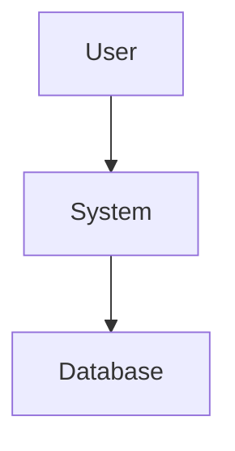

# 🚀 COMECE AQUI: Teste Especificação e Arquitetura

**Tempo**: 5 minutos para testar tudo  
**Status**: Pronto para usar agora!

---

## ⚡ Quick Start (3 comandos)

### 1. Abra 3 Terminais

**Terminal 1 - Backend**:
```bash
cd services
uvicorn api_gateway.main:app --reload --port 8086
```

**Terminal 2 - Frontend**:
```bash
cd frontend
npm run dev
```

**Terminal 3 - Ollama**:
```bash
ollama serve
```

---

## 🎯 Teste em 5 Passos (5 minutos)

### 1. Acesse o Sistema (30s)
```
URL: http://localhost:5173
Email: admin@example.com
Password: admin123
```

### 2. Abra um Projeto (30s)
- Clicar em "Projects"
- Abrir qualquer projeto existente
- OU criar novo projeto

### 3. Gere Requisitos se Necessário (1 min)
Se o projeto não tiver requisitos:
- Clicar "Generate Requirements"
- Usar texto simples:
  ```
  Sistema de vendas online com carrinho,
  pagamento e gestão de produtos
  ```
- Clicar "Approve All Requirements"

### 4. Teste Especificação ✅ (2 min)
1. Clicar botão **"Specification"** (ícone 📖)
2. Clicar **"Generate Specification"**
3. Aguardar 10-30 segundos
4. Ver especificação completa
5. Testar **"Copy to Clipboard"**
6. Fechar modal

### 5. Teste Arquitetura ✅ (2 min)
1. Clicar botão **"Architecture"** (ícone 🌐)
2. Clicar **"Generate Architecture"**
3. Aguardar 10-30 segundos
4. Ver arquitetura completa
5. Ver diagramas Mermaid extraídos
6. Testar copiar diagramas
7. Fechar modal

---

## ✅ O Que Você Deve Ver

### Especificação
```markdown
# 1. Visão Geral do Projeto
- Objetivo: ...
- Escopo: ...

# 2. Requisitos Funcionais
- RF001: Sistema deve...
- RF002: Sistema deve...

# 3. Requisitos Não-Funcionais
- Performance: < 200ms
- Segurança: JWT, HTTPS
...
```

### Arquitetura
```markdown
# 1. Visão Geral da Arquitetura
- Estilo: Microserviços
- Justificativa: ...

# 2. Diagrama de Contexto


# 3. Stack Tecnológico
- Frontend: React + TypeScript
- Backend: FastAPI + Python
...
```

**+ Diagramas Mermaid extraídos em caixas separadas!**

---

## 🎯 Checklist Rápido

Marque conforme testa:

**Especificação**:
- [ ] Modal abre
- [ ] Gera conteúdo (10-30s)
- [ ] Exibe formatado
- [ ] Botão "Copy" funciona
- [ ] Botão "Regenerate" funciona
- [ ] Botão "Close" funciona

**Arquitetura**:
- [ ] Modal abre (mais largo)
- [ ] Gera conteúdo (10-30s)
- [ ] Exibe formatado
- [ ] Diagramas Mermaid aparecem
- [ ] Copiar diagrama funciona
- [ ] Copiar conteúdo completo funciona
- [ ] Botão "Regenerate" funciona
- [ ] Botão "Close" funciona

---

## 🐛 Problemas Comuns

### "Nenhum requisito encontrado"
**Solução**: Gere e aprove requisitos primeiro (Passo 3)

### "Failed to generate"
**Soluções**:
1. Verificar se Ollama está rodando: `ollama serve`
2. Verificar se backend está rodando (Terminal 1)
3. Verificar console do browser (F12)

### Modal não abre
**Solução**: Recarregar página (Ctrl+R)

### Demora muito
**Normal**: Primeira geração pode levar 30s
**Ollama está processando**: Aguarde

---

## 🎉 Sucesso!

Se todos os itens do checklist estão ✅:

**Parabéns! A implementação está funcionando perfeitamente!** 🚀

### O que você tem agora:
- ✅ Geração automática de especificação
- ✅ Geração automática de arquitetura
- ✅ Diagramas Mermaid extraídos
- ✅ Copy to clipboard
- ✅ Regeneração ilimitada
- ✅ Workflow completo end-to-end

---

## 📚 Próximos Passos

### Usar em Projeto Real
1. Criar projeto real
2. Upload documentos reais
3. Gerar requisitos
4. Gerar especificação ✅
5. Gerar arquitetura ✅
6. Usar documentação gerada

### Explorar Mais
- Ver `TESTE_SPEC_ARCH.md` para teste detalhado
- Ver `PHASE9_SPEC_ARCH_IMPLEMENTATION.md` para detalhes técnicos
- Ver `COMPLETE_SYSTEM_GUIDE.md` para guia completo

---

## 🚀 Teste Alternativo: Script

Se preferir testar via script:

```bash
# Com backend rodando
uv run python scripts/test_spec_arch.py
```

Isso testa os endpoints diretamente.

---

## 💡 Dicas

### Para Melhor Resultado
1. **Requisitos claros**: Quanto melhores os requisitos, melhor a especificação
2. **Contexto rico**: Adicione descrição detalhada no projeto
3. **Regenerar**: Se não gostar, regenere quantas vezes quiser
4. **Copiar**: Use "Copy to Clipboard" para usar em outros docs

### Para Apresentações
1. Gere especificação
2. Gere arquitetura
3. Copie diagramas Mermaid
4. Cole em Mermaid Live Editor: https://mermaid.live
5. Export como imagem
6. Use em apresentações

---

## 📞 Ajuda

**Documentação Completa**:
- `TESTE_SPEC_ARCH.md` - Guia detalhado
- `PHASE9_SPEC_ARCH_IMPLEMENTATION.md` - Detalhes técnicos
- `IMPLEMENTACAO_SPEC_ARCH_COMPLETA.md` - Visão geral

**Troubleshooting**:
- Ver seção "Problemas Comuns" acima
- Verificar logs do backend
- Verificar console do browser (F12)

---

**Pronto para começar?** 🚀

1. Abra 3 terminais
2. Execute os 3 comandos
3. Acesse http://localhost:5173
4. Teste os botões "Specification" e "Architecture"

**É só isso!** ✨

---

**Status**: ✅ **PRONTO PARA USAR AGORA**  
**Tempo**: 5 minutos  
**Dificuldade**: Fácil

🎊 **Boa sorte e bom teste!** 🚀
