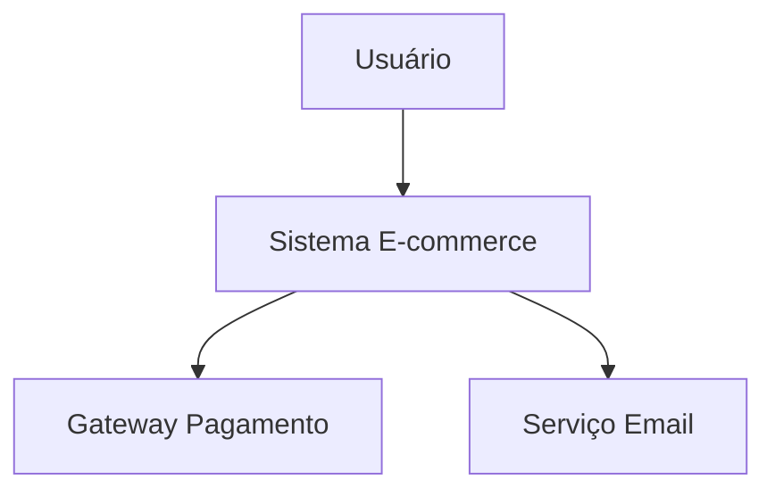

# 🧪 Guia de Teste: Especificação e Arquitetura

**Tempo estimado**: 10 minutos  
**Status**: Pronto para testar

---

## 🚀 Setup Rápido (2 minutos)

### Terminal 1: Backend
```bash
cd services
uvicorn api_gateway.main:app --reload --port 8086
```

### Terminal 2: Frontend
```bash
cd frontend
npm run dev
```

### Terminal 3: Ollama
```bash
ollama serve
```

---

## ✅ Teste Passo a Passo

### 1. Login (30 segundos)
```
URL: http://localhost:5173
Email: admin@example.com
Password: admin123
```

### 2. Criar ou Abrir Projeto (1 minuto)

**Opção A: Criar Novo**
- Clicar "New Project"
- Nome: "Sistema de Vendas Online"
- Descrição: "Plataforma de e-commerce moderna"
- Salvar

**Opção B: Usar Existente**
- Abrir projeto existente da lista

### 3. Gerar Requisitos (2 minutos)

Se o projeto não tiver requisitos:
- Usar qualquer método (texto, upload, URL)
- Exemplo texto:
  ```
  Sistema de e-commerce com carrinho de compras,
  pagamento online, gestão de produtos e pedidos
  ```
- Clicar "Generate Requirements"
- Aguardar geração
- Clicar "Approve All Requirements"

### 4. Testar Especificação ✅ (3 minutos)

1. **Abrir Modal**:
   - Clicar botão **"Specification"** (ícone de livro)
   - Modal deve abrir

2. **Gerar**:
   - Clicar **"Generate Specification"**
   - Ver spinner animado
   - Aguardar 10-30 segundos

3. **Validar Conteúdo**:
   - ✅ Especificação aparece em markdown
   - ✅ Formatação legível
   - ✅ Seções organizadas:
     - Visão Geral
     - Requisitos Funcionais
     - Requisitos Não-Funcionais
     - Regras de Negócio
     - Integrações
     - Glossário

4. **Testar Ações**:
   - ✅ Clicar **"Copy to Clipboard"**
     - Deve mostrar alert "Specification copied to clipboard!"
   - ✅ Clicar **"Regenerate"**
     - Deve limpar e gerar novamente
   - ✅ Clicar **"Close"**
     - Modal fecha

### 5. Testar Arquitetura ✅ (3 minutos)

1. **Abrir Modal**:
   - Clicar botão **"Architecture"** (ícone de rede)
   - Modal deve abrir (mais largo que o anterior)

2. **Gerar**:
   - Clicar **"Generate Architecture"**
   - Ver spinner animado
   - Aguardar 10-30 segundos

3. **Validar Conteúdo**:
   - ✅ Arquitetura completa aparece
   - ✅ Seções organizadas:
     - Visão Geral da Arquitetura
     - Diagramas C4
     - Componentes Principais
     - Stack Tecnológico
     - Requisitos Não-Funcionais
     - Decisões Arquiteturais (ADRs)
     - Padrões e Práticas
     - Deploy e Monitoramento

4. **Validar Diagramas Mermaid**:
   - ✅ Seção "Mermaid Diagrams (X)" aparece
   - ✅ Cada diagrama em caixa azul
   - ✅ Contador mostra quantidade
   - ✅ Código Mermaid visível

5. **Testar Ações**:
   - ✅ Clicar **"Copy"** em um diagrama
     - Deve mostrar alert "Diagram X copied to clipboard!"
   - ✅ Clicar **"Copy Full Content"**
     - Deve mostrar alert "Architecture copied to clipboard!"
   - ✅ Clicar **"Regenerate"**
     - Deve limpar e gerar novamente
   - ✅ Clicar **"Close"**
     - Modal fecha

---

## 🎯 Checklist de Validação

### Modal de Especificação
- [ ] Modal abre ao clicar "Specification"
- [ ] Botão "Generate Specification" funciona
- [ ] Loading state aparece (spinner)
- [ ] Especificação é gerada (10-30s)
- [ ] Conteúdo é exibido formatado
- [ ] Botão "Copy to Clipboard" funciona
- [ ] Botão "Regenerate" funciona
- [ ] Botão "Close" fecha o modal
- [ ] Erros são exibidos se houver

### Modal de Arquitetura
- [ ] Modal abre ao clicar "Architecture"
- [ ] Modal é mais largo (max-w-6xl)
- [ ] Botão "Generate Architecture" funciona
- [ ] Loading state aparece (spinner)
- [ ] Arquitetura é gerada (10-30s)
- [ ] Conteúdo completo é exibido
- [ ] Diagramas Mermaid são extraídos
- [ ] Seção de diagramas aparece
- [ ] Cada diagrama tem botão "Copy"
- [ ] Copiar diagrama individual funciona
- [ ] Botão "Copy Full Content" funciona
- [ ] Botão "Regenerate" funciona
- [ ] Botão "Close" fecha o modal
- [ ] Erros são exibidos se houver

---

## 🐛 Troubleshooting

### Erro: "Nenhum requisito encontrado"
**Solução**: Gere e aprove requisitos primeiro

### Erro: "Failed to generate"
**Possíveis causas**:
1. Ollama não está rodando
   - Solução: `ollama serve`
2. Modelo não está disponível
   - Solução: `ollama pull llama3.2`
3. Backend não está rodando
   - Solução: Verificar terminal do backend

### Modal não abre
**Solução**: 
1. Verificar console do browser (F12)
2. Verificar se há erros JavaScript
3. Recarregar página (Ctrl+R)

### Conteúdo não aparece
**Solução**:
1. Aguardar mais tempo (pode levar até 30s)
2. Verificar logs do backend
3. Verificar se Ollama está respondendo

### Diagramas não aparecem
**Causa**: Ollama não gerou diagramas Mermaid
**Solução**: Regenerar (o prompt deve incluir diagramas)

---

## 📊 Exemplo de Saída Esperada

### Especificação (Resumo)
```markdown
# 1. Visão Geral do Projeto
- Objetivo: Criar plataforma de e-commerce...
- Escopo: Sistema web responsivo...
- Stakeholders: Clientes, Administradores...

# 2. Requisitos Funcionais
## 2.1 Gestão de Produtos
- RF001: Sistema deve permitir cadastro de produtos
- RF002: Sistema deve permitir busca de produtos
...

# 3. Requisitos Não-Funcionais
## 3.1 Performance
- Tempo de resposta < 200ms (p95)
- Throughput: 1000 req/s
...
```

### Arquitetura (Resumo)
```markdown
# 1. Visão Geral da Arquitetura
- Estilo: Microserviços
- Justificativa: Escalabilidade e manutenibilidade
...

# 2. Diagrama de Contexto


# 3. Stack Tecnológico
## Frontend
- Framework: React + TypeScript
- UI: Tailwind CSS
...
```

---

## 🎉 Sucesso!

Se todos os itens do checklist estão ✅, a implementação está **100% funcional**!

### O que você consegue fazer agora:
1. ✅ Gerar especificação técnica completa
2. ✅ Gerar arquitetura com diagramas
3. ✅ Copiar conteúdo para usar em docs
4. ✅ Regenerar quantas vezes quiser
5. ✅ Workflow completo: Requisitos → Spec → Arquitetura

---

## 📸 Screenshots Esperados

### Modal de Especificação
```
┌─────────────────────────────────────┐
│ 📖 Generate Specification      [X] │
├─────────────────────────────────────┤
│ Generate a detailed technical...   │
│                                     │
│ ┌─────────────────────────────────┐ │
│ │ ✨ Generate Specification       │ │
│ └─────────────────────────────────┘ │
└─────────────────────────────────────┘
```

### Modal de Arquitetura (após geração)
```
┌──────────────────────────────────────────┐
│ 🌐 Generate Architecture          [X]   │
├──────────────────────────────────────────┤
│ [Conteúdo completo da arquitetura]      │
│                                          │
│ Mermaid Diagrams (3)                    │
│ ┌────────────────────────────────────┐  │
│ │ Diagram 1                  [Copy]  │  │
│ │ graph TB...                        │  │
│ └────────────────────────────────────┘  │
│                                          │
│ [Close] [Regenerate] [Copy Full Content]│
└──────────────────────────────────────────┘
```

---

## 🚀 Próximo Passo

Após validar que tudo funciona:
1. Use em projetos reais
2. Compartilhe a documentação gerada
3. Customize os prompts se necessário
4. Aproveite o workflow automatizado!

**Happy testing!** 🎊
